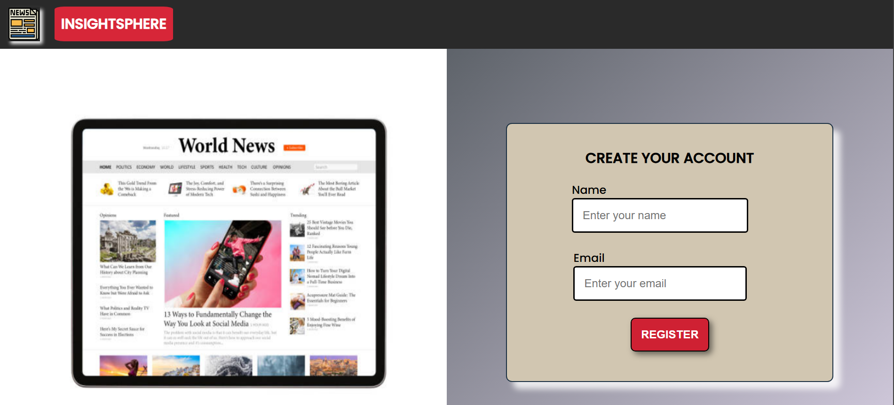
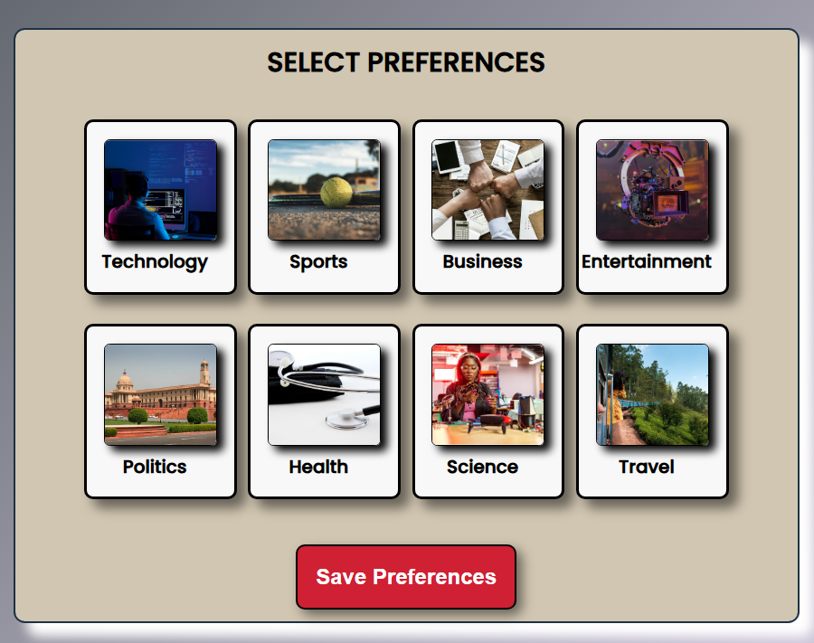
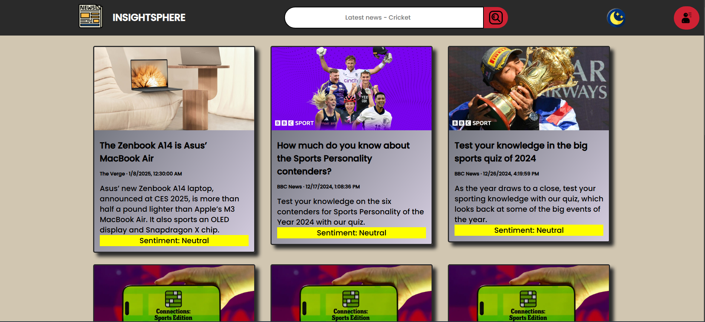

# News App

## Description
A simple and responsive News App that allows users to read the latest news articles from various categories. The app fetches news data from the News API and displays it in a user-friendly interface. It features search functionality, a slider for categories, and a dynamic interface that updates in real-time.

## Features
- Display news articles from multiple categories (e.g., Business, Sports, Technology, etc.)
- Search functionality to find specific news topics
- Slider bar to navigate between different news categories
- Mobile-responsive design for better user experience on all devices
- Real-time updates of news articles fetched from the News API

## Usage
- Use the slider bar to switch between different news categories.
- Use the search bar to find news related to a specific topic.
- Click on any article to read more details.

## Screenshots

